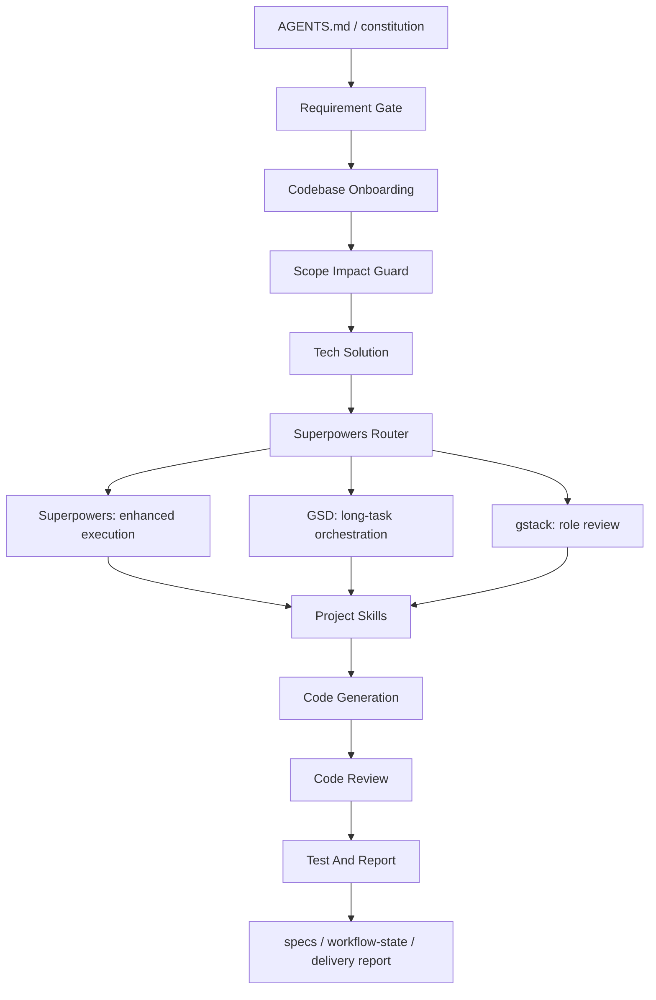

# Workflow Skills

English | [中文](README.zh-CN.md)

Workflow Skills is an enterprise AI engineering framework starter.

It helps teams bootstrap a project-level workflow layer that combines:

- spec-kit style specification artifacts
- Superpowers-style execution discipline
- GSD-style long-running task orchestration
- gstack-style role-based review
- project-local `SKILL.md` capabilities
- review, testing, and delivery reporting gates

The purpose is not to stack frameworks side by side. The purpose is to route them through one project constitution so AI-assisted development becomes scoped, reviewable, recoverable, and repeatable.

## Positioning

This repository defines and ships a lightweight version of an enterprise AI development operating system.

Core formula:

```text
Enterprise AI Framework
= Spec-Driven Development
+ Context Engineering
+ Agent Governance
+ Test-Driven Verification
+ Reusable Skills
+ LLMOps Harness
```

The current package focuses on the first practical layer:

- structured project workflow
- local skills
- feature specs
- workflow state
- enhanced capability routing
- review and test closure

## Goals

- Preserve intent from request to delivery through structured specs.
- Keep project memory durable across sessions through `specs/` and `workflow-state.yaml`.
- Make agent autonomy reliable by routing capabilities through explicit governance.
- Build quality into the workflow through review and verification gates.
- Keep adoption lightweight enough for existing repositories.

## Architecture



## Component Mapping

| Dimension | Responsibility | Implementation in this repo |
| --- | --- | --- |
| Spec-driven development | Capture intent and acceptance criteria as contracts | `.specify`, `specs/<feature>/spec.md`, `plan.md`, `tasks.md` |
| Agent governance | Control routing, scope, roles, and delivery gates | `AGENTS.md`, `constitution.md`, project router skills |
| Reusable skills | Encapsulate project-local capabilities | `.agents/skills/*/SKILL.md` |
| Test-driven verification | Keep implementation tied to validation | `project-code-review`, `project-test-and-report`, configured test command |
| Context engineering | Preserve task state and handoff context | `workflow-state.yaml`, specs, docs |
| LLMOps-ready harness | Prepare for future observability, safety, and evaluation | structured reports, risks, role reviews, capability routes |

## Quick Start

```bash
npx @workflow-skills/project-engineering-workflow init \
  --project-name "CRM Platform" \
  --project-slug "crm-platform" \
  --stack-name "React + Node.js" \
  --app-path "apps/web" \
  --test-command "pnpm test" \
  --output-dir "/absolute/path/to/your-repo"
```

Validate the generated workflow:

```bash
npx @workflow-skills/project-engineering-workflow doctor \
  --output-dir "/absolute/path/to/your-repo"
```

For local development in this repository:

```bash
node project-engineering-workflow/bin/project-engineering-workflow.mjs init \
  --project-name "CRM Platform" \
  --project-slug "crm-platform" \
  --stack-name "React + Node.js" \
  --app-path "apps/web" \
  --test-command "pnpm test" \
  --output-dir "/absolute/path/to/your-repo"
```

## Generated Project Layout

```text
.
├── AGENTS.md
├── .agents/
│   └── skills/
├── .specify/
│   ├── memory/
│   ├── templates/
│   └── scripts/
├── specs/
│   └── <feature>/
│       ├── spec.md
│       ├── plan.md
│       ├── tasks.md
│       ├── quickstart.md
│       ├── workflow-state.yaml
│       └── checklists/
└── docs/
    ├── Codex团队开发说明.md
    └── AI协作架构.md
```

## Delivery Workflow

1. Turn the request into a requirement analysis.
2. Read the relevant codebase path before editing.
3. Lock the smallest safe scope.
4. Write a technical solution when the task is cross-layer or risky.
5. Route enhanced capabilities through `project-superpowers-router`.
6. Use `project-gsd-router` for long-running or context-heavy work.
7. Use `project-gstack-router` for PM, design, engineering, QA, ship, or reflection review.
8. Create feature artifacts under `specs/<feature>/`.
9. Implement through project-local skills.
10. Close with code review, test report, uncovered areas, and residual risks.

## Implementation Roadmap

| Phase | Goal | Focus |
| --- | --- | --- |
| Phase 1: MVP | Run the loop on one real project | spec-kit artifacts, core skills, Superpowers routing, review and test closure |
| Phase 2: Memory and governance | Make work resumable and multi-role | `workflow-state.yaml`, GSD milestones, gstack review lanes |
| Phase 3: Enterprise readiness | Add observability, evaluation, and safety | LLMOps dashboards, regression evals, security gateway, skill marketplace |

## Risk Controls

| Risk | Control |
| --- | --- |
| Framework conflict | Keep `AGENTS.md` and `constitution.md` as the only top-level authority |
| Context overload | Use GSD-style milestones and `workflow-state.yaml` instead of loading everything |
| Scope drift | Require requirement, scope, and impact gates before implementation |
| Unverified output | Close every task with review and test reporting |
| Unsafe side effects | Route external effects through explicit confirmation and rollback notes |

## Repository Layout

```text
project-engineering-workflow/
├── SKILL.md
├── agents/
│   └── openai.yaml
├── assets/
│   └── template-root/
├── bin/
│   └── project-engineering-workflow.mjs
├── references/
├── scripts/
│   ├── bootstrap-project.sh
│   └── doctor.sh
└── package.json
```

## Local Checks

```bash
npm --prefix project-engineering-workflow run doctor
```

Package dry-run:

```bash
npm pack --dry-run --package-lock=false --cache /private/tmp/npm-cache-workflow-skills
```

## Package

```text
@workflow-skills/project-engineering-workflow
```


## 鸣谢
感谢 https://vsllm.com 支持
