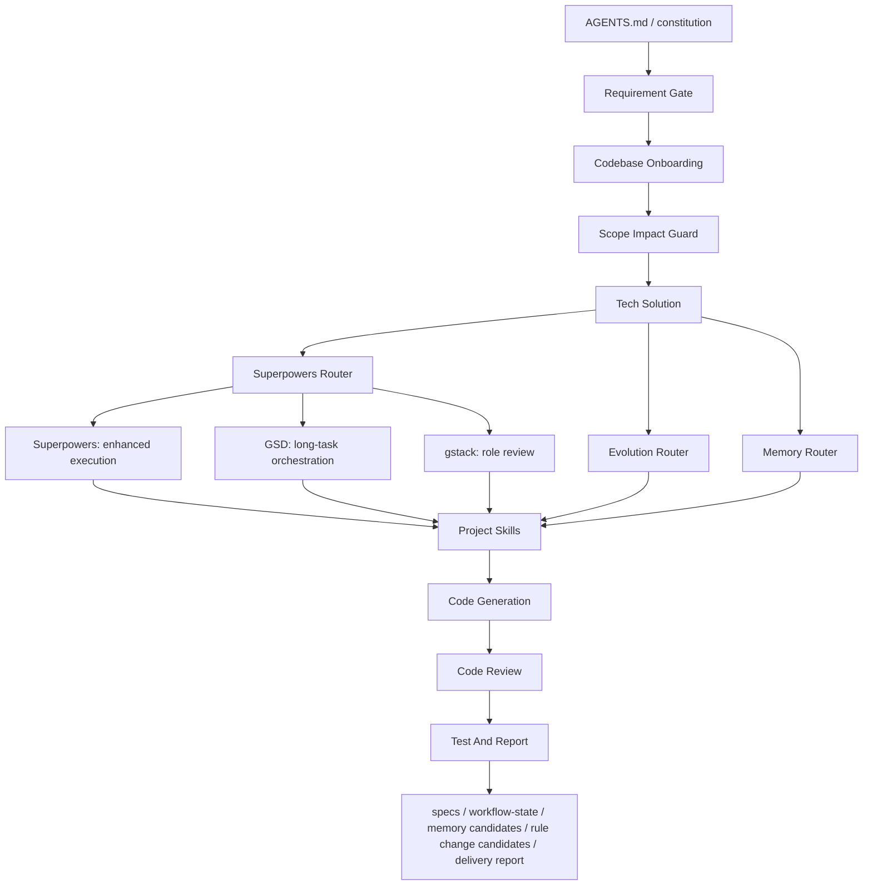

# Workflow Skills

English | [中文](README.zh-CN.md)

Workflow Skills is a Skill product system with two core pillars:

1. a complete `Workflow + Skill Framework`
2. a visual `Skill Management & Analysis Tool`

It is not just an MCP manager, and it is not just a prompt library. The primary product object is always the `skill`, while `MCP` is only one possible capability source inside the skill ecosystem.

## Dual-Core Positioning

### Core 1: Workflow + Skill Framework

This is the production layer.

Its job is to turn scattered prompts, scripts, agent conventions, MCP calls, and engineering rules into a reusable, governable, collaborative, packageable, and publishable skill framework.

### Core 2: Visual Skill Management & Analysis Tool

This is the governance layer.

Its job is to make local and remote skills visible so users can understand:

- where skills live
- what role a skill plays
- how skills compose together
- which skills are duplicated
- which skills are valuable
- which skills are costly, slow, unhealthy, or worth optimizing

Every future product adjustment should be measured against two questions:

1. Does it strengthen the `Workflow + Skill Framework`?
2. Does it strengthen `visual skill management and analysis`?

It helps teams bootstrap a project-level workflow layer that combines:

- spec-kit style specification artifacts
- memory policy, session reflection, and workflow evolution artifacts
- Superpowers-style execution discipline
- GSD-style long-running task orchestration
- gstack-style role-based review
- project-local `SKILL.md` capabilities
- Codex and Claude Code harness guidance
- review, testing, and delivery reporting gates

The purpose is not to stack frameworks side by side. The purpose is to route workflow, skills, governance, and analysis through one coherent Skill product system.

## Positioning

This repository defines and ships a lightweight Skill operating system with workflow production on one side and visual skill governance on the other.

Core formula:

```text
Enterprise AI Framework
= Spec-Driven Development
+ Context Engineering
+ Agent Governance
+ Test-Driven Verification
+ Reusable Skills
+ LLMOps Harness
```

The current repository focuses on two practical anchors:

- a complete workflow + skill framework
- a local-first visual skill management and analysis tool
- structured project workflow, local skills, feature specs, and workflow state
- enhanced capability routing, default development rules, frontend stack rules, security review, and staged verification
- Codex / Claude Code workflow distinction, review, test closure, evaluation, and token economics

## Goals

- Preserve intent from request to delivery through structured specs.
- Keep project memory durable across sessions through `specs/` and `workflow-state.yaml`.
- Capture session summaries and workflow upgrade signals through `.specify/memory/session-history.md` and `.specify/memory/skill-upgrade-backlog.md`.
- Make agent autonomy reliable by routing capabilities through explicit governance.
- Build quality into the workflow through review and verification gates.
- Keep adoption lightweight enough for existing repositories.

## Architecture



## Component Mapping

| Dimension | Responsibility | Implementation in this repo |
| --- | --- | --- |
| Spec-driven development | Capture intent and acceptance criteria as contracts | `.specify`, `specs/<feature>/spec.md`, `plan.md`, `tasks.md` |
| Agent governance | Control routing, scope, roles, and delivery gates | `AGENTS.md`, `constitution.md`, project router skills |
| Reusable skills | Encapsulate project-local capabilities | `.agents/skills/*/SKILL.md` |
| Test-driven verification | Keep implementation tied to validation | `project-code-review`, `project-verification-loop`, `project-test-and-report`, configured test command |
| Context engineering | Preserve task state, handoff context, memory candidates, and rule change proposals | `workflow-state.yaml`, specs, docs, memory and evolution policies |
| LLMOps-ready harness | Prepare for future observability, safety, and evaluation | structured reports, risks, role reviews, capability routes |

## Quick Start

```bash
npx @workflow-skills/project-engineering-workflow init \
  --project-name "CRM Platform" \
  --project-slug "crm-platform" \
  --stack-name "React + Node.js" \
  --app-path "apps/web" \
  --test-command "pnpm test" \
  --output-dir "/absolute/path/to/your-repo"
```

Validate the generated workflow:

```bash
npx @workflow-skills/project-engineering-workflow doctor \
  --output-dir "/absolute/path/to/your-repo"
```

For local development in this repository:

```bash
node project-engineering-workflow/bin/project-engineering-workflow.mjs init \
  --project-name "CRM Platform" \
  --project-slug "crm-platform" \
  --stack-name "React + Node.js" \
  --app-path "apps/web" \
  --test-command "pnpm test" \
  --output-dir "/absolute/path/to/your-repo"
```

## Generated Project Layout

```text
.
├── AGENTS.md
├── .agents/
│   └── skills/
├── .specify/
│   ├── memory/
│   ├── templates/
│   └── scripts/
├── specs/
│   └── <feature>/
│       ├── spec.md
│       ├── plan.md
│       ├── tasks.md
│       ├── quickstart.md
│       ├── delivery-summary.md
│       ├── task-reflection.md
│       ├── rule-change-proposal.md
│       ├── memory-policy.md
│       ├── evolution-policy.md
│       ├── evolution-prefill-policy.md
│       ├── evolution-draft-protocol.md
│       ├── reflection-output-protocol.md
│       ├── final-output-protocol.md
│       ├── workflow-state.yaml
│       └── checklists/
└── docs/
    ├── Codex团队开发说明.md
    ├── ClaudeCode团队开发说明.md
    ├── AI协作架构.md
    ├── AI能力地图.md
    └── 升级兼容策略.md
```

## Delivery Workflow

1. Turn the request into a requirement analysis.
2. Read the relevant codebase path before editing.
3. Lock the smallest safe scope.
4. Write a technical solution when the task is cross-layer or risky.
5. Route enhanced capabilities through `project-superpowers-router`.
6. Use `project-gsd-router` for long-running or context-heavy work.
7. Use `project-gstack-router` for PM, design, engineering, QA, ship, or reflection review.
8. Use `project-memory-router` for remembering, forgetting, retrieving, preferences, team knowledge, session summaries, or agent self-improvement.
9. Use `project-evolution-router` when repeated learnings should upgrade workflow rules, skills, templates, or constitution.
10. Create feature artifacts under `specs/<feature>/`.
11. Implement through project-local skills.
12. Run security review and staged verification when the change touches sensitive or shared paths.
13. Close with code review, test report, uncovered areas, residual risks, and memory or rule-change candidates when useful.

## Implementation Roadmap

| Phase | Goal | Focus |
| --- | --- | --- |
| Phase 1: MVP | Run the loop on one real project | spec-kit artifacts, core skills, Superpowers routing, review and test closure |
| Phase 2: Memory and governance | Make work resumable and multi-role | `workflow-state.yaml`, GSD milestones, gstack review lanes |
| Phase 3: Enterprise readiness | Add observability, evaluation, and safety | LLMOps dashboards, regression evals, security gateway, skill marketplace |

## Risk Controls

| Risk | Control |
| --- | --- |
| Framework conflict | Keep `AGENTS.md` and `constitution.md` as the only top-level authority |
| Context overload | Use GSD-style milestones and `workflow-state.yaml` instead of loading everything |
| Repeated workflow friction | Record it in session history and upgrade backlog, then update the smallest relevant skill |
| Frontend rule drift | Keep generic dev rules in `project-dev-core` and frontend rules in stack-specific layers |
| Security drift | Route auth, secrets, inputs, APIs, database, private data, and external effects through `project-security-review` |
| Memory drift or privacy leakage | Split memory into user-private, team-shared, agent-self, and task-session scopes; ask before durable updates |
| Self-evolution drift | Turn repeated feedback into rule proposals first; validate and keep rollback paths for framework changes |
| Scope drift | Require requirement, scope, and impact gates before implementation |
| Unverified output | Close meaningful changes with `project-verification-loop`, review, and test reporting |
| Unsafe side effects | Route external effects through explicit confirmation and rollback notes |

## Repository Layout

```text
project-engineering-workflow/
├── SKILL.md
├── agents/
│   └── openai.yaml
├── assets/
│   └── template-root/
├── bin/
│   └── project-engineering-workflow.mjs
├── references/
├── scripts/
│   ├── bootstrap-project.sh
│   └── doctor.sh
└── package.json
```

## Local Checks

```bash
npm --prefix project-engineering-workflow run doctor
node evaluations/skills-workflow/scripts/check-contract.mjs
```

Use `evaluations/skills-workflow/templates/quality-metrics.md` for A/B runs. The workflow should be judged by routing precision, task outcome, safety, verification strength, friction cost, output clarity, maintainability, and learning-loop quality, not only by whether a skill was mentioned.

Use `evaluations/skills-workflow/templates/token-economics.md` and `evaluations/skills-workflow/scripts/estimate-token-cost.mjs` to compare quality gain against token cost. Real A/B runs should record provider usage metadata when available.

Package dry-run:

```bash
npm pack --dry-run --package-lock=false --cache /private/tmp/npm-cache-workflow-skills
```

## Package

```text
@workflow-skills/project-engineering-workflow
```


## 鸣谢
感谢 https://vsllm.com 支持
