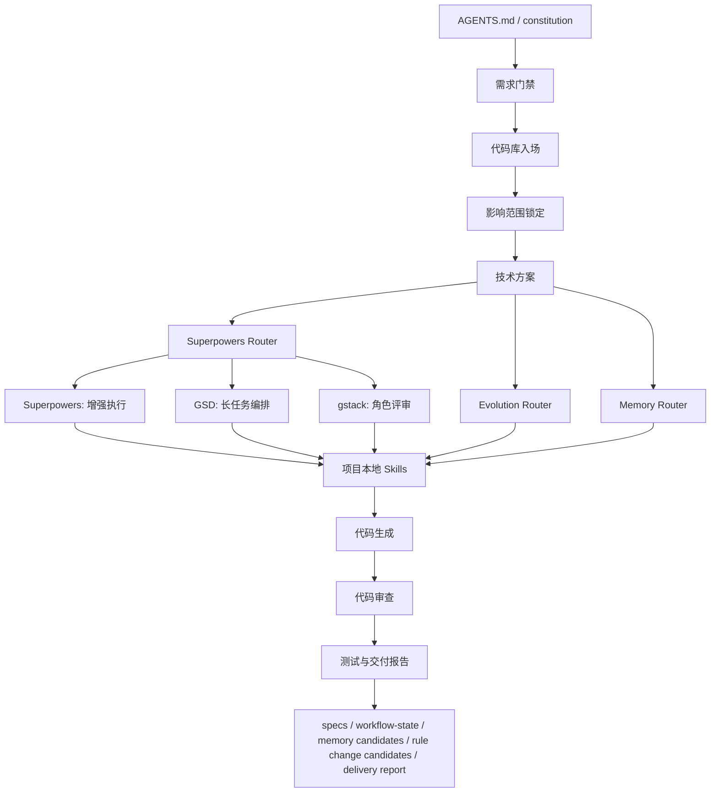

# Workflow Skills

[English](README.md) | 中文

Workflow Skills 是一个由两个核心组成的 Skill 产品体系：

1. 一套完整的 `Workflow + Skill Framework`
2. 一个可视化的 `Skill 管理分析工具`

它不是单纯的 MCP 管理器，也不是普通的提示词库。它的核心对象始终是 `skill`，而 `MCP` 只是 skill 生态中的一种能力来源。

## 双核心定位

### 核心一：Workflow + Skill Framework

这是生产层。

目标是把零散的 prompt、脚本、Agent 约定、MCP 调用和工程规则，组织成一套可复用、可治理、可协作、可打包、可发布的 skill framework。

### 核心二：可视化 Skill 管理分析工具

这是治理层。

目标是把本地与远程的 skill 可视化，让用户能看清：

- skill 在哪里
- skill 是什么角色
- skill 如何组合
- skill 是否重复
- skill 是否有价值
- skill 的成本、性能、健康度和优化空间

以后所有功能调整都应优先回答两个问题：

1. 这个改动是否增强了 `Workflow + Skill Framework`
2. 这个改动是否增强了 `Skill 的可视化管理与分析`

它把以下能力组合成一套可接入、可治理、可恢复、可验证的项目底座：

- spec-kit 风格的规格与交付工件
- 记忆策略、会话复盘与框架进化工件
- Superpowers 风格的增强执行与验证纪律
- GSD 风格的长任务编排与上下文续航
- gstack 风格的角色化评审
- 基于 `SKILL.md` 的项目本地 skills
- Codex 与 Claude Code 的 harness 适配说明
- code review、测试报告、剩余风险说明等交付门禁

这不是把多个框架简单堆在一起，而是把 workflow、skill、治理规则和可视化分析路由进同一套 Skill 产品体系。

## 文档定位

本项目旨在定义并落地一套以 `workflow + skill` 为生产核心、以 `visual analysis` 为治理核心的 Skill 操作系统。

核心公式：

```text
Enterprise AI Framework
= Spec-Driven Development
+ Context Engineering
+ Agent Governance
+ Test-Driven Verification
+ Reusable Skills
+ LLMOps Harness
```

当前仓库先聚焦两个可落地核心：

- 一套完整的 workflow + skill framework
- 一个本地优先的可视化 skill 管理分析工具
- 项目级 AI 协作规则、本地 skills、feature 级规格工件和 workflow 状态文件
- Superpowers / GSD / gstack 路由、默认开发规范、前端 JS / React / Vue / CSS 规范层、安全审查和分阶段验证闭环
- Codex / Claude Code 工作流差异、review 与测试收口、评估体系和 token 成本分析

## 核心目标

- 意图无损：从需求到交付，以结构化规格作为事实来源。
- 持续记忆：通过 `specs/` 和 `workflow-state.yaml` 保存跨会话上下文。
- 会话回收：通过 `.specify/memory/session-history.md` 和 `.specify/memory/skill-upgrade-backlog.md` 记录会话总结与升级信号。
- 可靠自治：增强能力必须经过范围、权限、角色和验证门禁。
- 质量内置：把 review、测试报告、未覆盖项和剩余风险作为交付的一部分。
- 低门槛接入：优先服务已有项目，不要求一开始就重构业务代码。

## 架构全景



## 组件映射

| 架构维度 | 核心职责 | 当前落地 |
| --- | --- | --- |
| 规格驱动开发 | 定义意图、验收标准和技术约束 | `.specify`、`specs/<feature>/spec.md`、`plan.md`、`tasks.md` |
| 智能体治理 | 控制流程、范围、角色和交付门禁 | `AGENTS.md`、`constitution.md`、router skills |
| 可复用技能 | 把原子能力封装为声明式模块 | `.agents/skills/*/SKILL.md` |
| 测试驱动验证 | 用 review、验证闭环和测试保护实现质量 | `project-code-review`、`project-verification-loop`、`project-test-and-report`、项目测试命令 |
| 上下文工程 | 保存任务状态、交接信息、历史决策、记忆候选和规则变更提案 | `workflow-state.yaml`、`specs`、`docs`、`memory-policy.md`、`evolution-policy.md` |
| LLMOps 预留层 | 为后续可观测性、评估、安全、成本控制预留结构 | 结构化报告、能力路由、角色评审、剩余风险 |

## 快速接入

```bash
npx @workflow-skills/project-engineering-workflow init \
  --project-name "CRM Platform" \
  --project-slug "crm-platform" \
  --stack-name "React + Node.js" \
  --app-path "apps/web" \
  --test-command "pnpm test" \
  --output-dir "/absolute/path/to/your-repo"
```

接入后做一次体检：

```bash
npx @workflow-skills/project-engineering-workflow doctor \
  --output-dir "/absolute/path/to/your-repo"
```

本仓库本地调试：

```bash
node project-engineering-workflow/bin/project-engineering-workflow.mjs init \
  --project-name "CRM Platform" \
  --project-slug "crm-platform" \
  --stack-name "React + Node.js" \
  --app-path "apps/web" \
  --test-command "pnpm test" \
  --output-dir "/absolute/path/to/your-repo"
```

## 生成后的项目结构

```text
.
├── AGENTS.md
├── .agents/
│   └── skills/
├── .specify/
│   ├── memory/
│   ├── templates/
│   └── scripts/
├── specs/
│   └── <feature>/
│       ├── spec.md
│       ├── plan.md
│       ├── tasks.md
│       ├── quickstart.md
│       ├── delivery-summary.md
│       ├── task-reflection.md
│       ├── rule-change-proposal.md
│       ├── memory-policy.md
│       ├── evolution-policy.md
│       ├── evolution-prefill-policy.md
│       ├── evolution-draft-protocol.md
│       ├── reflection-output-protocol.md
│       ├── final-output-protocol.md
│       ├── workflow-state.yaml
│       └── checklists/
└── docs/
    ├── Codex团队开发说明.md
    ├── ClaudeCode团队开发说明.md
    ├── AI协作架构.md
    ├── AI能力地图.md
    └── 升级兼容策略.md
```

## 核心工作流

1. 意图规格化：把用户请求转成需求目标、约束、影响模块和验收标准。
2. 代码库入场：先读相关模块、依赖、配置和风险点。
3. 范围锁定：确认最小安全改动面，区分直接影响和联动影响。
4. 技术方案：复杂任务先写方案，明确目录、接口、状态、测试和回退点。
5. 能力路由：通过 `project-superpowers-router` 判断是否需要增强能力。
6. 长任务编排：多轮、多天、跨模块任务启用 `project-gsd-router`。
7. 角色评审：产品、设计、工程、QA、发布判断启用 `project-gstack-router`。
8. 记忆路由：涉及记住、遗忘、偏好、团队知识、会话总结或自我提升时启用 `project-memory-router`。
9. 进化路由：涉及 skill、模板、流程、宪法持续优化时启用 `project-evolution-router`。
10. 交付工件：在 `specs/<feature>/` 下生成 spec、plan、tasks、workflow state、记忆候选和规则变更候选。
11. 实现与复用：通过 project-local skills 做最小安全实现。
12. 安全与验证：敏感或共享路径变更进入 `project-security-review` 和 `project-verification-loop`。
13. 收口交付：完成 code review、测试报告、未覆盖项、剩余风险说明，以及记忆/规则候选确认。

## 路由矩阵

| 任务类型 | 推荐通道 | 收口方式 |
| --- | --- | --- |
| 局部 bug 或小改动 | 基础 workflow | `project-test-and-report` |
| 需要浏览器、生成资产、外部工具或多代理 | `project-superpowers-router` | 工具结果进入 review 和 test report |
| 多模块、多轮、长周期任务 | `project-superpowers-router` -> `project-gsd-router` | 更新 `workflow-state.yaml` |
| 产品、设计、发布或 QA 判断 | `project-superpowers-router` -> `project-gstack-router` | 角色结论进入 plan、review 或 report |
| 高风险外部副作用 | `project-superpowers-router` + 用户确认 | 记录影响范围、结果和回退方式 |

## 实施路径

| 阶段 | 目标 | 核心任务 |
| --- | --- | --- |
| 第一阶段：MVP | 在单个项目跑通闭环 | 接入 `AGENTS.md`、`.agents/skills`、`.specify`、`specs`，跑通一个真实需求 |
| 第二阶段：记忆与治理 | 提升跨会话稳定性 | 使用 `workflow-state.yaml`，沉淀 GSD 里程碑，补齐 gstack 角色评审 |
| 第三阶段：企业级就绪 | 加入观测、评估、安全与成本治理 | 接入 LLMOps、自动化评估、安全网关、技能市场和团队指标 |

## 风险与缓解

| 风险 | 缓解措施 |
| --- | --- |
| 框架冲突与内耗 | `AGENTS.md` 和 `constitution.md` 作为唯一最高规则 |
| 上下文爆炸 | 使用 GSD 原子任务和 `workflow-state.yaml` 控制上下文预算 |
| 重复流程摩擦 | 记录到会话历史和升级 backlog，再更新最小相关 skill |
| 前端规则发散 | 通用开发规范放 `project-dev-core`，前端规则放分层 skill |
| 安全规则遗漏 | auth、secrets、输入、API、数据库、隐私数据、外部副作用进入 `project-security-review` |
| 记忆漂移或隐私泄漏 | 把记忆拆成用户私有、团队共享、agent 自身和任务会话四类；长期更新前先确认 |
| 自我进化失控 | 先形成规则提案，再确认、验证、保留回滚路径，不允许静默自改 |
| 需求漂移 | 需求门禁、范围锁定、验收标准必须先于实现 |
| AI 产出不可验证 | 重要变更必须以 `project-verification-loop`、review、测试报告和剩余风险收口 |
| 外部副作用失控 | 发布、部署、远端数据、凭证、定时任务必须显式确认并记录回退方式 |

## 仓库结构

```text
project-engineering-workflow/
├── SKILL.md
├── agents/
│   └── openai.yaml
├── assets/
│   └── template-root/
├── bin/
│   └── project-engineering-workflow.mjs
├── references/
├── scripts/
│   ├── bootstrap-project.sh
│   └── doctor.sh
└── package.json
```

## 本地检查

```bash
npm --prefix project-engineering-workflow run doctor
node evaluations/skills-workflow/scripts/check-contract.mjs
```

A/B 验证使用 `evaluations/skills-workflow/templates/quality-metrics.md`。判断 workflow 是否变好，不能只看 skill 有没有命中，还要看路由精度、任务结果、安全范围、验证强度、摩擦成本、输出清晰度、可维护性和学习闭环。

A/B 成本分析使用 `evaluations/skills-workflow/templates/token-economics.md` 和 `evaluations/skills-workflow/scripts/estimate-token-cost.mjs`。真实 A/B 运行优先记录 provider usage metadata，静态估算用于提前发现过大的 skill 和过度触发风险。

发布包 dry-run：

```bash
npm pack --dry-run --package-lock=false --cache /private/tmp/npm-cache-workflow-skills
```

## npm 包名

```text
@workflow-skills/project-engineering-workflow
```
