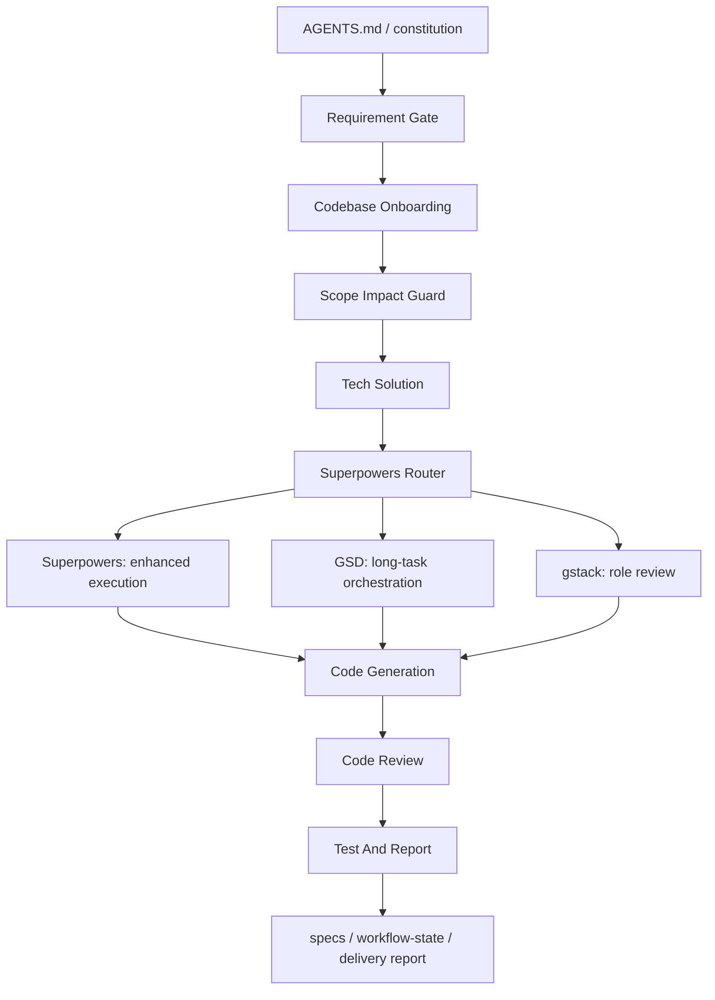

# __PROJECT_NAME__ AI 协作架构

本项目的 AI 协作架构可以理解为：

```text
spec-kit + Superpowers + GSD + gstack + project-local skills
```

更准确地说，这不是五套流程并列运行，而是用 project-local skills 把不同能力接入同一套项目规则。

## 架构总览



## 分层职责

### 1. 总控层

`AGENTS.md` 和 `.specify/memory/constitution.md` 是最高规则。

它们决定：

- 什么请求必须先分析需求
- 什么场景必须锁定范围
- 什么变更需要技术方案
- 哪些目录和文件属于流程资产
- 交付前必须完成哪些 review 和测试说明

### 2. 工件层

`.specify` 和 `specs` 承担 spec-kit 风格的交付工件。

它们保存：

- `spec.md`: 需求和验收标准
- `plan.md`: 技术方案和取舍
- `tasks.md`: 可执行任务拆分
- `quickstart.md`: 验证或使用入口
- `checklists/delivery.md`: 交付检查
- `workflow-state.yaml`: 长任务、能力路由、角色评审和恢复状态

### 3. 能力层

`Superpowers`、`GSD`、`gstack` 是三类能力来源。

- `Superpowers` 负责增强执行，例如浏览器自动化、生成资产、多代理、外部工具、本地验证。
- `GSD` 负责长任务编排，例如多轮任务、里程碑、上下文恢复、状态续航。
- `gstack` 负责角色化判断，例如 PM、设计、工程、QA、发布、复盘。

### 4. 适配层

`.agents/skills` 是项目本地适配层。

关键入口：

- `project-superpowers-router`: 所有增强能力的统一入口。
- `project-gsd-router`: 长任务和状态续航入口。
- `project-gstack-router`: 角色化判断入口。

这个层的作用是把外部方法变成项目可控的本地流程，而不是让外部方法绕过项目规则。

### 5. 收口层

实现、审查和验证仍由项目自己的 skills 收口。

- `project-code-generation`: 最小安全实现。
- `project-code-review`: 缺陷、回归、边界和风险审查。
- `project-test-and-report`: 命令、结果、未覆盖项和剩余风险说明。

## 路由原则

- 普通小改动走基础 workflow。
- 需要工具、自动化、资产生成或外部能力时走 `project-superpowers-router`。
- 多轮、多天、上下文容易丢失的任务再走 `project-gsd-router`。
- 产品、设计、工程、QA、发布等角色判断再走 `project-gstack-router`。
- 所有增强能力结果都必须回收到 spec、plan、tasks、review 或 test report。
- 任何增强能力都不能绕过需求确认、范围锁定、review 和测试报告。

## 简短定义

## Codex 与 Claude Code 适配

Codex 和 Claude Code 共用同一套项目工程规则：

- `AGENTS.md`
- `.agents/skills`
- `.specify`
- `specs`
- `docs`

差异只在 harness 能力层：

- Codex 默认依赖 `AGENTS.md`、project-local skills、sandbox、approval、MCP 和可选 multi-agent。
- Claude Code 可以额外接入 hooks、slash commands、subagents 和 Claude 专属配置。

原则：

- 共用规则放在 `AGENTS.md` 和 `.agents/skills`。
- Codex 专属说明放在 `docs/Codex团队开发说明.md`。
- Claude Code 专属说明放在 `docs/ClaudeCode团队开发说明.md`。
- hooks、MCP、远端工具和自动化只做 opt-in，不作为默认项目底座。
- 任何 harness 增强能力都不能绕过需求确认、范围锁定、review、verification 和 test report。

这套架构的核心不是拼接多个框架，而是：

> 用 project-local skills 把 spec-kit、Superpowers、GSD、gstack 路由进同一套项目工程宪法。
