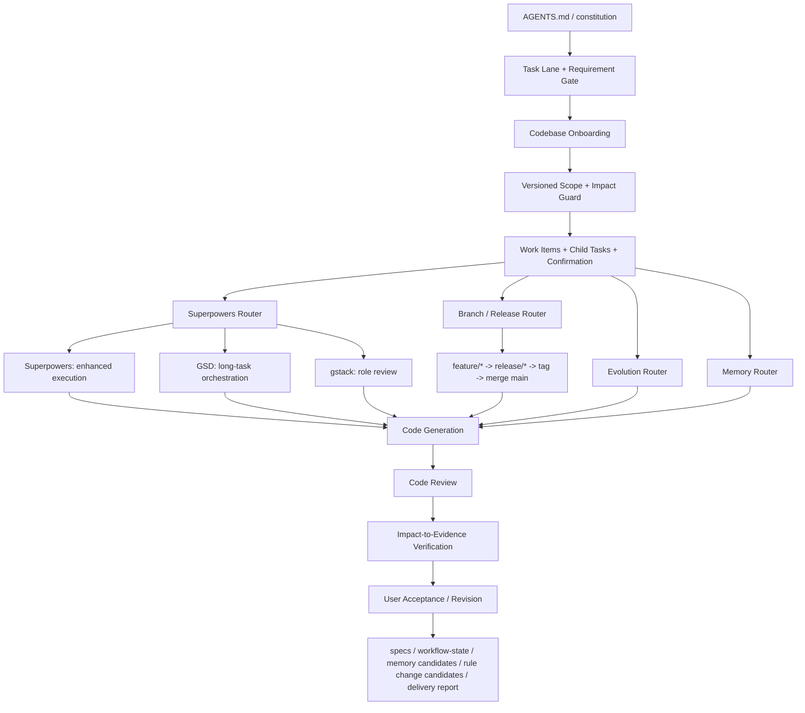

# __PROJECT_NAME__ AI 协作架构

本项目的 AI 协作架构可以理解为：

```text
spec-kit + Memory Router + Evolution Router + Branch/Release Router + Superpowers + GSD + gstack + project-local skills
```

更准确地说，这不是五套流程并列运行，而是用 project-local skills 把不同能力接入同一套项目规则。

如果你想快速理解“什么时候走哪条链”，请配合阅读：`docs/AI能力地图.md`
如果你想理解“新版本如何不破坏旧项目升级”，请配合阅读：`docs/升级兼容策略.md`
如果你想从产品视角理解“框架本身如何分层，而不是如何全局安装”，请阅读：`references/09-framework-modules-blueprint.md`

## 架构总览



## 分层职责

### 1. 总控层

`AGENTS.md` 和 `.specify/memory/constitution.md` 是最高规则。

它们决定：

- 任务走 fast、standard 还是 controlled
- 什么请求必须先分析需求
- 什么场景必须锁定范围
- 什么变更需要技术方案
- 哪些确认门禁必须等待用户，确认绑定哪个版本
- 哪些目录和文件属于流程资产
- 交付前必须完成哪些 review 和测试说明

### 2. 工件层

`.specify` 和 `specs` 承担 spec-kit 风格的交付工件。

它们保存：

- `spec.md`: 需求和验收标准
- `plan.md`: 技术方案和取舍
- `tasks.md`: 可执行任务拆分
- `quickstart.md`: 验证或使用入口
- `checklists/delivery.md`: 交付检查
- `workflow-state.yaml`: 长任务、能力路由、角色评审和恢复状态
- `workflow-state.yaml`: 同时保存任务通道、需求/影响/计划/验证版本、确认门禁、事项、影响维度和范围变化
- `memory-policy.md`: 记忆分域、保留期、检索和写入确认规则
- `delivery-summary.md`: 面向用户的标准中文交付总结
- `task-reflection.md`: 每次有意义任务结束后的固定复盘输出
- `evolution-prefill-policy.md`: 规则提案半成品的自动预填规则
- `evolution-draft-protocol.md`: 规则提案第一版的起草顺序、证据优先级和状态同步规则
- `reflection-output-protocol.md`: 复盘文档如何同步到工作状态和规则提案链路
- `final-output-protocol.md`: 最终交付总结如何串联验证、复盘、记忆和规则候选
- `rule-change-proposal.md`: 规则变更提案、证据、验证和回滚的展开文档
- `release-checklist.md`: 发布前检查项
- `release-notes.md`: 版本变更说明和验证结果

### 3. 记忆层

`project-memory-router` 负责把可复用上下文变成可治理的记忆候选。

它回答四个问题：

- 记给谁：用户私有、团队共享、agent 自身、任务会话。
- 记什么：事实、偏好、行为模式、关系、决策、会话总结。
- 记多久：临时、一周、一个月、持久、直到功能关闭。
- 怎么取：精确查找、模糊联想、多跳推理。

关键约束：

- 用户私有记忆按用户身份隔离；无法识别用户时不跨人合并。
- 团队共享记忆需要来源、owner 或明确上下文。
- agent 自身总结只作为候选，持久化前必须和用户确认。
- 每次有意义的会话结束后，可以在 `workflow-state.yaml` 记录会话总结、用户选择、选择原因和记忆候选。

### 4. 进化层

`project-evolution-router` 负责把多次任务里被验证的规律，升级为框架规则提案。

它处理的问题是：

- 这次经验只是记忆，还是该改 workflow？
- 该改 skill、memory policy、AGENTS、template，还是 constitution？
- 这个升级有没有证据、验证方式和回滚方式？

它遵循“先提案、再确认、后验证”的闭环，而不是让框架自动静默自改。

### 5. 能力层

`Superpowers`、`GSD`、`gstack` 是三类能力来源。

- `Superpowers` 负责增强执行，例如浏览器自动化、生成资产、多代理、外部工具、本地验证。
- `GSD` 负责长任务编排，例如多轮任务、里程碑、上下文恢复、状态续航。
- `gstack` 负责角色化判断，例如 PM、设计、工程、QA、发布、复盘。

### 6. 分支与发布层

`project-branch-release` 负责把 git 分支流和发布动作纳入项目规则。

它处理的问题是：

- 默认从哪里切功能分支
- 什么条件下允许进入 release 分支
- 什么时候可以打 tag
- 什么情况下允许 merge 到 `main`

默认策略是：

- `main -> feature/<feature-slug> -> release/<version> -> v<version> -> merge main`

### 7. 适配层

`.agents/skills` 是项目本地适配层。

关键入口：

- `project-memory-router`: 记忆分域、生命周期、检索方式和写入确认入口。
- `project-evolution-router`: 规则变更提案、晋级层级、验证与回滚入口。
- `project-branch-release`: 功能分支、发布分支、tag 与 merge 主干入口。
- `project-superpowers-router`: 所有增强能力的统一入口。
- `project-gsd-router`: 长任务和状态续航入口。
- `project-gstack-router`: 角色化判断入口。

这个层的作用是把外部方法变成项目可控的本地流程，而不是让外部方法绕过项目规则。

### 8. 收口层

实现、审查和验证仍由项目自己的 skills 收口。

- `project-code-generation`: 最小安全实现。
- `project-code-review`: 缺陷、回归、边界和风险审查。
- `project-test-and-report`: 命令、结果、未覆盖项和剩余风险说明。

## 路由原则

- 普通小改动走基础 workflow。
- 需要工具、自动化、资产生成或外部能力时走 `project-superpowers-router`。
- 多轮、多天、上下文容易丢失的任务再走 `project-gsd-router`。
- 产品、设计、工程、QA、发布等角色判断再走 `project-gstack-router`。
- 涉及功能分支、发布分支、tag、merge 主干时走 `project-branch-release`。
- 涉及记住、遗忘、偏好、团队知识、会话总结、自我提升时走 `project-memory-router`。
- 涉及 skill、模板、流程、宪法的持续优化时走 `project-evolution-router`。
- 所有增强能力结果都必须回收到 spec、plan、tasks、review 或 test report。
- 所有长期记忆更新都必须先展示候选并获得用户确认。
- 所有长期规则更新都必须先展示提案并通过验证。
- 任何增强能力都不能绕过需求确认、范围锁定、review 和测试报告。

## 简短定义

## Codex 与 Claude Code 适配

Codex 和 Claude Code 共用同一套项目工程规则：

- `AGENTS.md`
- `.agents/skills`
- `.specify`
- `specs`
- `docs`

差异只在 harness 能力层：

- Codex 默认依赖 `AGENTS.md`、project-local skills、sandbox、approval、MCP 和可选 multi-agent。
- Claude Code 可以额外接入 hooks、slash commands、subagents 和 Claude 专属配置。

原则：

- 共用规则放在 `AGENTS.md` 和 `.agents/skills`。
- Codex 专属说明放在 `docs/Codex团队开发说明.md`。
- Claude Code 专属说明放在 `docs/ClaudeCode团队开发说明.md`。
- hooks、MCP、远端工具和自动化只做 opt-in，不作为默认项目底座。
- 任何 harness 增强能力都不能绕过需求确认、范围锁定、review、verification 和 test report。

这套架构的核心不是拼接多个框架，而是：

> 用 project-local skills 把 spec-kit、Superpowers、GSD、gstack 路由进同一套项目工程宪法。

记忆能力的核心是：

> 把上下文从“隐式聊天历史”升级为“分域、限期、可检索、可确认的协作资产”。

进化能力的核心是：

> 把一次次任务反馈，从“临时经验”升级为“可提案、可验证、可回滚的框架演进”。
