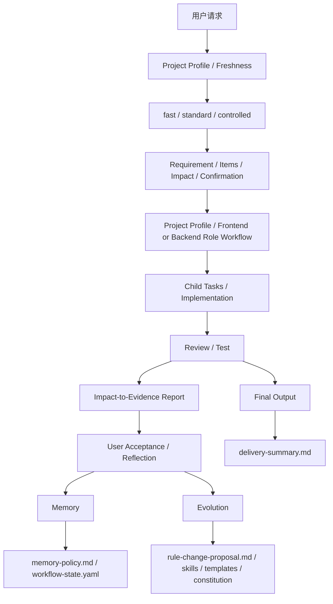

# __PROJECT_NAME__ AI 能力地图

这张能力地图用于帮助团队快速理解：

- 这套框架有哪些能力层
- 每类能力解决什么问题
- 什么时候该走哪条链路
- 最终会沉淀成什么工件

## 一图总览

## 七条主链

### 0. Project Context 主链

用途：

- 首次识别项目技术栈、目录结构、架构、关键链路、配置真值和验证命令
- 把已验证事实保存到项目本地 Profile，后续按证据指纹复用
- 只在证据变化、模块未知或缓存冲突时增量刷新

入口：

- `project-profile-router`
- `.specify/scripts/project-profile.mjs`

产物：

- `.specify/project-profile/profile.yaml`
- `.specify/project-profile/architecture.md`
- `.specify/project-profile/decision-memory.yaml`
- 忽略的 `local-state.json` 证据指纹

门禁：

- Profile 是项目事实缓存，不是权限或任务批准
- 源码和配置真值优先于缓存
- 只加载与当前模块和任务类型匹配的决策

### 1. Delivery 主链

用途：

- 把需求变成交付
- 把实现变成可验证结果
- 按复杂度控制确认成本
- 把事项和影响范围追溯到验证证据

入口：

- `project-requirement-gate`
- `project-codebase-onboarding`
- `project-scope-impact-guard`
- `project-tech-solution`
- `project-backend-standards`，后端角色流程按架构、契约、数据、运行时和验证信号渐进加载
- `project-frontend-standards`，前端角色流程按体验、状态、无障碍、性能和验证信号渐进加载
- `project-code-generation`
- `project-code-review`
- `project-test-and-report`

产物：

- `spec.md`
- `plan.md`
- `tasks.md`
- `quickstart.md`
- `delivery-summary.md`

门禁：

- fast：清楚且低风险时不强制多轮确认
- standard：确认需求、事项、验收和影响范围
- controlled：再确认子任务、依赖、验证和回滚
- 范围漂移：暂停并确认新增差异
- 单一表面任务：只加载对应角色入口和命中的 references；全栈任务也不默认加载两个完整角色包

### 2. Memory 主链

用途：

- 记住对未来任务有帮助的稳定信息
- 区分用户私有、团队共享、agent 自身、任务会话四类记忆

入口：

- `project-memory-router`

产物：

- `memory-policy.md`
- `workflow-state.yaml` 中的 `session_reflections`、`memory_candidates`
- `.specify/memory-store/index.json`
- `.specify/memory-store/users/*`
- `.specify/memory-store/shared/memories.jsonl`
- `.specify/memory-store/agent/evolution.jsonl`

### 3. Evolution 主链

用途：

- 把重复出现的经验升级成规则提案
- 决定该改 memory policy、skill、workflow、template 还是 constitution

入口：

- `project-evolution-router`

产物：

- `rule-change-proposal.md`
- `workflow-state.yaml` 中的 `rule_change_candidates`、`evolution_updates`

### 4. Reflection 主链

用途：

- 在每次有意义任务结束后做结构化复盘
- 把“做了什么、用户选了什么、哪里有效、哪里需要改进”沉淀下来

入口：

- `task-reflection.md`
- `reflection-output-protocol.md`

产物：

- `task-reflection.md`
- `workflow-state.yaml` 中的 `reflection_artifacts`

### 5. Final Output 主链

用途：

- 给用户一份标准中文交付总结
- 把验证、风险、用户选择、记忆/进化后续统一收口

入口：

- `project-test-and-report`
- `final-output-protocol.md`

产物：

- `delivery-summary.md`
- `workflow-state.yaml` 中的 `delivery_artifacts`

### 6. Branch / Release 主链

用途：

- 让每次开发默认走 `feature/*`
- 让验证通过后的发布走 `release/* -> tag -> merge main`

入口：

- `project-branch-release`
- `create-feature-branch.sh`
- `prepare-release.sh`
- `finalize-release.sh`

产物：

- `release-policy.md`
- `release-checklist.md`
- `release-notes.md`
- `workflow-state.yaml` 中的 `branch_flow`

## 什么时候走哪条链

| 场景 | 主要链路 | 典型结果 |
| --- | --- | --- |
| 普通需求开发 | Delivery | 代码 + 测试报告 + 交付总结 |
| 用户说“记住这个偏好” | Memory | memory candidate 或 policy 更新 |
| 多次出现同类流程问题 | Evolution | 规则提案或模板更新 |
| 任务刚做完，需要沉淀经验 | Reflection | task reflection + state sync |
| 需要给用户正式收尾 | Final Output | delivery summary |
| 需要切功能分支、准备发布或合并主干 | Branch / Release | feature branch、release branch、tag、release artifacts |

## Onboarding 建议

新人首次接触这套框架，推荐阅读顺序：

1. `AGENTS.md`
2. `docs/AI协作架构.md`
3. `docs/AI能力地图.md`
4. `.specify/memory/constitution.md`
5. `.specify/memory/memory-policy.md`
6. `specs/<feature>/` 下的真实工件
7. `docs/升级兼容策略.md`

## 升级兼容提醒

- 新能力默认对新项目直接生成
- 对旧项目默认只提示可选升级
- minor 升级不应让旧 `specs/<feature>/` 工件失效

## 一句话记忆法

- Delivery：把任务做完
- Memory：把经验记住
- Evolution：把规律升级成规则
- Reflection：把本次过程讲清楚
- Final Output：把结果对用户讲明白
- Branch / Release：把代码安全送上主干并形成可追溯版本
